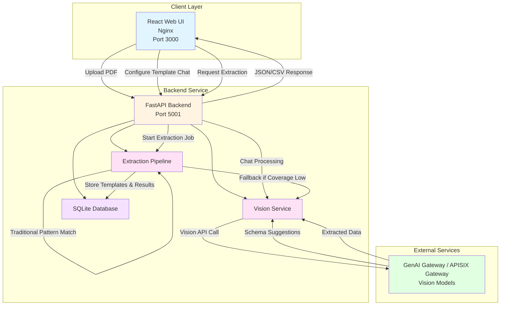
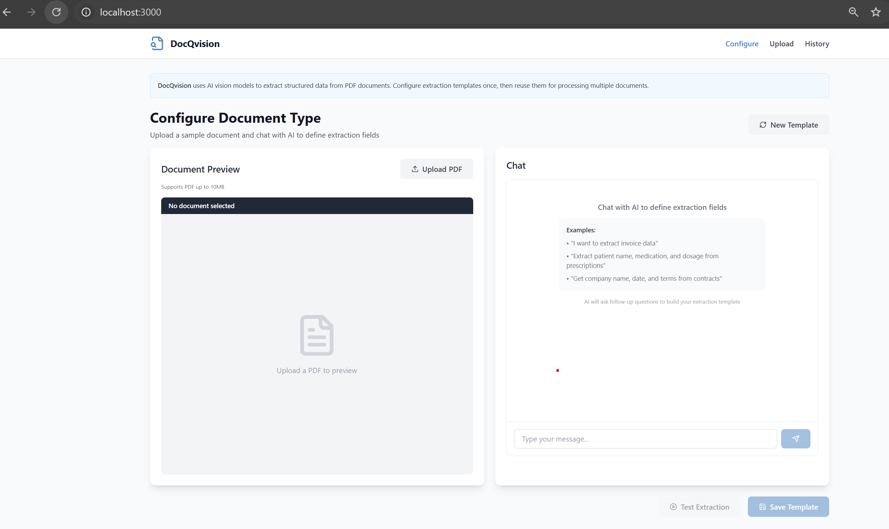
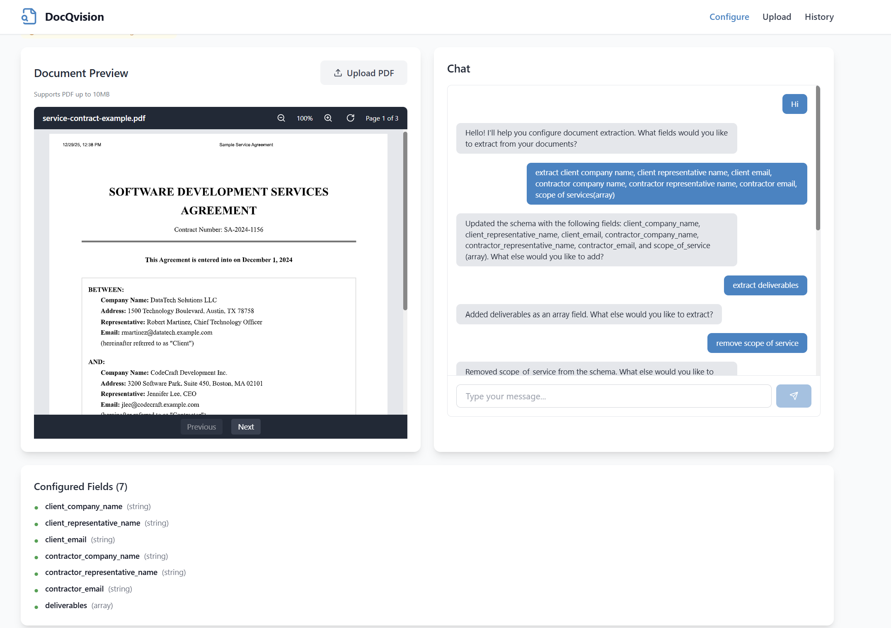
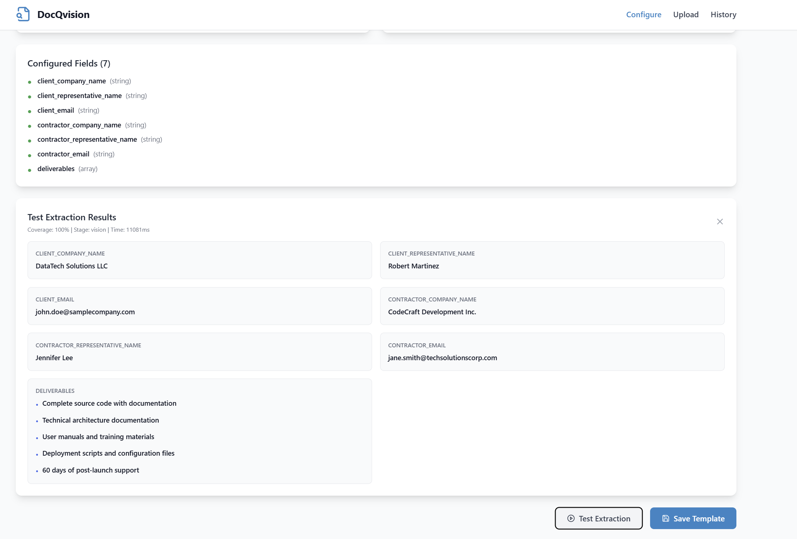
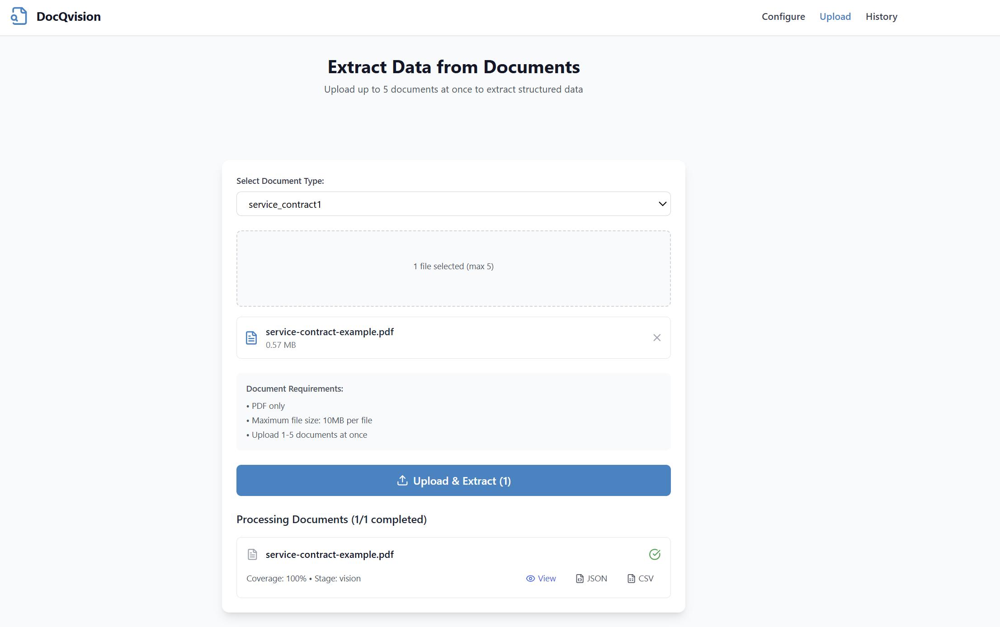
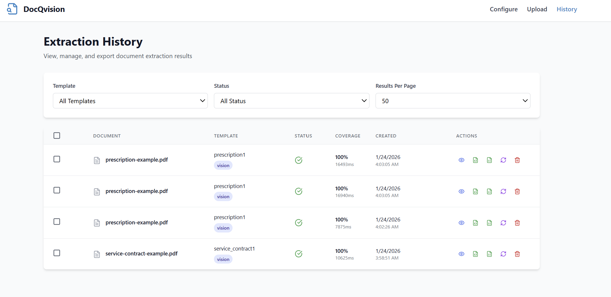

# DocQvision

AI-powered document processing platform that extracts structured data from PDF documents using vision-language models. The system features conversational schema configuration through vision AI assistance, template management, and a multi-stage extraction pipeline that combines traditional pattern matching with vision model extraction as an intelligent fallback.

## Table of Contents

- [Project Overview](#project-overview)
- [Features](#features)
- [Architecture](#architecture)
- [Prerequisites](#prerequisites)
- [Quick Start Deployment](#quick-start-deployment)
- [User Interface](#user-interface)
- [Troubleshooting](#troubleshooting)

---

## Project Overview

DocQvision demonstrates how AI can automatically extract structured data from various document types including invoices, prescriptions, contracts, and forms. Users configure extraction templates through natural language conversation with vision AI, upload documents for batch processing, and export extracted data in multiple formats. The application supports GenAI Gateway and APISIX Gateway for enterprise deployments.

---

## Features

**Backend**

- Multi-stage extraction pipeline with intelligent fallback (Traditional → Vision AI)
- Document type validation using vision models
- Conversational schema configuration with vision AI assistance
- Template system for reusable extraction configurations
- Batch document processing (up to 5 files simultaneously)
- Multiple export formats (JSON, CSV)
- Field coverage analysis and quality scoring
- Background job processing with real-time status updates
- Enterprise authentication support (GenAI Gateway, APISIX Gateway)
- SQLite database for persistence
- Document deduplication using SHA-256 hashing
- Comprehensive error handling and logging

**Frontend**

- Clean, intuitive interface with multi-page navigation
- Interactive PDF viewer with zoom and page navigation
- Drag-and-drop file upload with validation
- Conversational template configuration interface
- Real-time extraction progress monitoring
- Extraction history with filtering and search
- Template management dashboard
- Re-extraction capability for failed jobs
- Mobile-responsive design with Tailwind CSS

---

## Architecture



**Service Components**

1. **React Web UI (Port 3000)**
   - Modern React application with responsive styling
   - Handles user interactions and file uploads
   - Interactive PDF preview with zoom controls
   - Real-time extraction status monitoring
   - Served via Nginx

2. **Backend Service (Port 5001)**
   - FastAPI-based modular architecture
   - Multi-stage extraction pipeline (Traditional → Vision AI)
   - Document type validation before extraction
   - Template and document management with SQLite persistence
   - Background job processing
   - Field coverage scoring system

3. **External Services**
   - GenAI Gateway or APISIX Gateway with API key authentication
   - Vision-language models for extraction and validation

**Typical Flow:**

1. User configures extraction template through conversational interface with vision AI
2. AI assistant guides user to define fields and data types
3. User tests extraction on sample document
4. Template is saved for reuse
5. User selects template and uploads documents for batch processing
6. Backend validates document type matches template
7. Extraction pipeline processes documents page-by-page (traditional first, vision AI fallback)
8. Results are displayed with coverage metrics and export options
9. User can view history and re-run failed extractions

---

## Prerequisites

### System Requirements

Before you begin, ensure you have the following installed:

- **Docker and Docker Compose**
- **GenAI Gateway** or **APISIX Gateway** access configured

### Verify Docker Installation

```bash
# Check Docker version
docker --version

# Check Docker Compose version
docker compose version

# Verify Docker is running
docker ps
```

### Required API Configuration

**For Inference Service (Document Extraction):**

This application supports multiple inference deployment patterns:

**GenAI Gateway**: Provide your GenAI Gateway URL and API key
- **URL format**: `https://api.example.com`
- To generate the GenAI Gateway API key, use the [generate-vault-secrets.sh](https://github.com/opea-project/Enterprise-Inference/blob/main/core/scripts/generate-vault-secrets.sh) script
- The API key is the `litellm_master_key` value from the generated `vault.yml` file

**APISIX Gateway**: Provide your APISIX Gateway URL and authentication token
- **URL format**: `https://api.example.com/Qwen2.5-VL-7B-Instruct`
- **Note**: APISIX requires the model name in the URL path (without company/family prefixes)
- To generate the APISIX authentication token, use the [generate-token.sh](https://github.com/opea-project/Enterprise-Inference/blob/main/core/scripts/generate-token.sh) script
- The token is generated using Keycloak client credentials

**Configuration requirements:**
- **INFERENCE_API_ENDPOINT**: URL to your inference service (example: `https://api.example.com`)
- **INFERENCE_API_TOKEN**: Authentication token/API key for your chosen service

---

## Quick Start Deployment

### Clone the Repository

```bash
git clone https://github.com/cld2labs/GenAISamples.git
cd GenAISamples/DocQvision
```

### Set up the Environment

This application requires **two `.env` files** for proper configuration:

1. **Root `.env` file** (for Docker Compose variables)
2. **`api/.env` file** (for backend application configuration)

#### Step 1: Create Root `.env` File

```bash
# From the DocQvision directory
cat > .env << EOF
# Docker Compose Configuration
LOCAL_URL_ENDPOINT=not-needed
EOF
```

**Note:** If using a local domain (e.g., `api.example.com` mapped to localhost), replace `not-needed` with your domain name (without `https://`).

#### Step 2: Create `api/.env` File

Copy from the example file and edit with your actual credentials:

```bash
cp api/.env.example api/.env
```

Then edit `api/.env` to set your `INFERENCE_API_ENDPOINT` and `INFERENCE_API_TOKEN`.

Or manually create `api/.env` with:

```bash
# =============================================================================
# DocQvision Configuration
# =============================================================================

# Inference API Configuration
# INFERENCE_API_ENDPOINT: URL to your inference service (without /v1 suffix)
#
# **GenAI Gateway**: Provide your GenAI Gateway URL and API key
#   - URL format: https://api.example.com
#   - To generate the GenAI Gateway API key, use the [generate-vault-secrets.sh] script
#   - The API key is the litellm_master_key value from the generated vault.yml file
#
# **APISIX Gateway**: Provide your APISIX Gateway URL and authentication token
#   - URL format: https://api.example.com/Qwen2.5-VL-7B-Instruct
#   - Note: APISIX requires the model name in the URL path (without company/family prefixes)
#   - To generate the APISIX authentication token, use the [generate-token.sh] script
#   - The token is generated using Keycloak client credentials
#
# INFERENCE_API_TOKEN: Authentication token/API key for the inference service
INFERENCE_API_ENDPOINT=https://api.example.com
INFERENCE_API_TOKEN=your-pre-generated-token-here

# Docker Network Configuration
# LOCAL_URL_ENDPOINT: Required if using local domain mapping (e.g., api.example.com -> localhost)
# Set to your domain name (without https://) or leave as "not-needed" if using public URLs
LOCAL_URL_ENDPOINT=not-needed

# Vision Model Configuration
VISION_MODEL=Qwen/Qwen2.5-VL-7B-Instruct
DETECTION_MODEL=Qwen/Qwen2.5-VL-7B-Instruct
VISION_MAX_TOKENS=4000
VISION_TEMPERATURE=0.1

# File Upload Limits
MAX_UPLOAD_MB=10
MAX_PDF_PAGES=50
MAX_BATCH_UPLOAD=5

# Extraction Pipeline Configuration
EXTRACTION_COVERAGE_THRESHOLD=0.8
VISION_MAX_PAGES=5

# Service Configuration
LOG_LEVEL=INFO
ENVIRONMENT=production

# CORS Settings
CORS_ORIGINS=http://localhost:3000,http://localhost:5173

# Security Configuration
# SSL Verification: Set to false only for development with self-signed certificates
VERIFY_SSL=true
```

**Important Configuration Notes:**

- **INFERENCE_API_ENDPOINT**: Your actual inference service URL (replace `https://api.example.com`)
  - For APISIX/Keycloak deployments, the model name must be included in the endpoint URL (e.g., `https://api.example.com/Qwen2.5-VL-7B-Instruct`)
- **INFERENCE_API_TOKEN**: Your actual pre-generated authentication token
- **VISION_MODEL** and **DETECTION_MODEL**: Use the exact model names from your inference service
- **LOCAL_URL_ENDPOINT**: Only needed if using local domain mapping

**Note**: The docker-compose.yml file automatically loads environment variables from both `.env` (root) and `./api/.env` (backend) files.

### Running the Application

Start both API and UI services together with Docker Compose:

```bash
# From the DocQvision directory
docker compose up --build

# Or run in detached mode (background)
docker compose up -d --build
```

What happens during deployment:
- Docker builds images for frontend and backend (first time: 3-5 minutes)
- Creates containers for both services
- Sets up networking between services
- Initializes SQLite database

### Verify Deployment

Check that all containers are running:

```bash
docker compose ps
```

Expected output - You should see 2 containers with status "Up":

| Container Name | Port | Status |
|----------------|------|--------|
| `DocQvision-backend` | 5001 | Up (healthy) |
| `DocQvision-frontend` | 3000 | Up (healthy) |

If any container shows "Restarting" or "Exited", check logs:

```bash
docker compose logs -f
```

**View logs:**

```bash
# All services
docker compose logs -f

# Backend only
docker compose logs -f DocQvision-backend

# Frontend only
docker compose logs -f DocQvision-frontend
```

**Verify the services are running:**

```bash
# Check API health
curl http://localhost:5001/health

# Check if containers are running
docker compose ps
```

### Local Development (Without Docker)

For local development with hot reload:

**Backend:**
```bash
cd api
pip install -r requirements.txt
python main.py
```

**Frontend:**
```bash
cd ui
npm install
npm run dev
```

The backend will run on http://localhost:5001 and frontend on http://localhost:5173

## User Interface

**Using the Application**

Access the application at http://localhost:3000

### Configure Template Page

Define extraction fields through conversational vision AI interface.





**Steps:**
1. Upload a sample PDF document.
2. Chat with vision AI to define fields (e.g., "client Company name, client representative name, patient name, invoice number, etc.")
3. Review configured schema.
4. Test extraction on sample document.
5. Save template for reuse.



### Upload Documents Page

Process single or multiple documents with selected template.



**Steps:**
1. Select document template from dropdown
2. Upload 1-5 PDF files (drag-and-drop or file picker)
3. Click "Upload & Extract"
4. Monitor real-time extraction progress
5. View results or download JSON/CSV


### History Page

Browse past extraction jobs with filtering and search.



**Features:**
- Filter by template or status
- View extraction metadata (coverage, processing time)
- Re-run failed extractions
- Export results to JSON or CSV
- Delete old extraction records
- Bulk operations on multiple records

### API Documentation

Interactive API documentation available at:
- **Swagger UI**: http://localhost:5001/docs
- **ReDoc**: http://localhost:5001/redoc

## Troubleshooting

For comprehensive troubleshooting guidance, common issues, and solutions, refer to:

[TROUBLESHOOTING.md](./TROUBLESHOOTING.md)
