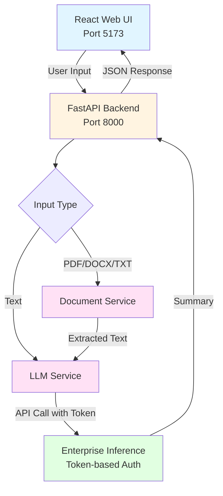

## Document Summarization

A full-stack document summarization application that processes text and document files to generate concise summaries with enterprise inference integration.

## Table of Contents

- [Project Overview](#project-overview)
- [Features](#features)
- [Architecture](#architecture)
- [Prerequisites](#prerequisites)
- [Quick Start Deployment](#quick-start-deployment)
- [User Interface](#user-interface)
- [Troubleshooting](#troubleshooting)
- [Additional Info](#additional-info)

---

## Project Overview

The **Document Summarization** application processes multiple content formats to generate concise summaries. Users can paste text or upload documents (PDF, DOCX, TXT). The backend uses enterprise inference endpoints with token-based authentication for all text summarization operations.

---

## Features

**Backend**

- Multiple input format support (text, PDF, DOCX, TXT)
- PDF text extraction with OCR support for image-based PDFs
- DOCX document processing
- Enterprise inference integration with token-based authentication
- File validation and size limits (PDF/DOCX: 50 MB)
- CORS enabled for web integration
- Comprehensive error handling and logging
- Health check endpoints
- Modular architecture (routes + services)

**Frontend**

- Clean, intuitive interface with tab-based input selection
- Drag-and-drop file upload
- Real-time summary display
- Mobile-responsive design with Tailwind CSS
- Built with Vite for fast development

---

## Architecture

Below is the architecture showing how user input is processed through document extraction, then summarized using the enterprise inference endpoint.



The application consists of:
1. **Document Processing Service**: Extracts text from PDF, DOCX, and TXT files
2. **LLM Service**: Generates summaries using enterprise inference API
3. **API Layer**: FastAPI backend with token-based authentication
4. **UI**: React-based interface with Vite and Tailwind CSS

**Service Components:**

1. **React Web UI (Port 5173)** - Provides intuitive interface with drag-and-drop file upload, tab-based input selection, and real-time summary display

2. **FastAPI Backend (Port 8000)** - Orchestrates document processing, handles token-based authentication, and routes requests to appropriate processing services

**Typical Flow:**

1. User inputs text or uploads a document (PDF/DOCX/TXT) through the web UI.
2. The backend processes the input:
   - Text: Sent directly to LLM service
   - PDF/DOCX/TXT: Extracted using document service with OCR support
3. The LLM service uses the pre-configured token to call the enterprise inference endpoint.
4. The model generates a summary using the configured LLM (e.g., Llama-3.1-8B-Instruct).
5. The summary is returned and displayed to the user via the UI.

---

## Prerequisites

### System Requirements

Before you begin, ensure you have the following installed:

- **Docker and Docker Compose**
- **Enterprise inference endpoint access** (token-based authentication)

### Required API Configuration

**For Inference Service:**

This application supports multiple inference deployment patterns:

- **GenAI Gateway**: Provide your GenAI Gateway URL and API key
  - To generate the GenAI Gateway API key, use the [generate-vault-secrets.sh](https://github.com/opea-project/Enterprise-Inference/blob/main/core/scripts/generate-vault-secrets.sh) script
  - The API key is the `litellm_master_key` value from the generated `vault.yml` file
  
- **APISIX Gateway**: Provide your APISIX Gateway URL and authentication token
  - To generate the APISIX authentication token, use the [generate-token.sh](https://github.com/opea-project/Enterprise-Inference/blob/main/core/scripts/generate-token.sh) script
  - The token is generated using Keycloak client credentials

### Local Development Configuration

**For Local Testing Only (Optional)**

If you're testing with a local inference endpoint using a custom domain (e.g., `api.example.com` mapped to localhost in your hosts file):

1. Edit `backend/.env` and set:
   ```bash
   LOCAL_URL_ENDPOINT=api.example.com
   ```
   (Use the domain name from your INFERENCE_API_ENDPOINT without `https://`)

2. This allows Docker containers to resolve your local domain correctly.

**Note:** For public domains or cloud-hosted endpoints, leave the default value `not-needed`.

### Verify Docker Installation

```bash
# Check Docker version
docker --version

# Check Docker Compose version
docker compose version

# Verify Docker is running
docker ps
```

---

## Quick Start Deployment

### Clone the Repository

```bash
git clone https://github.com/opea-project/Enterprise-Inference.git
cd Enterprise-Inference/sample_solutions/DocSummarization
```

### Set up the Environment

This application requires **two `.env` files** for proper configuration:

1. **Root `.env` file** (for Docker Compose variables)
2. **`backend/.env` file** (for backend application configuration)

#### Step 1: Create Root `.env` File

You can either copy from the example file:

```bash
cp .env.example .env
```

Then edit `.env` if needed, **OR** create it directly:

```bash
# From the DocSummarization directory
cat > .env << EOF
# Docker Compose Configuration
LOCAL_URL_ENDPOINT=not-needed
EOF
```

**Note:** If using a local domain (e.g., `api.example.com` mapped to localhost), replace `not-needed` with your domain name (without `https://`).

#### Step 2: Create `backend/.env` File

You can either copy from the example file:

```bash
cp backend/.env.example backend/.env
```

Then edit `backend/.env` with your actual credentials, **OR** create it directly:

```bash
cat > backend/.env << EOF
# Inference API Configuration
# INFERENCE_API_ENDPOINT: URL to your inference service (without /v1 suffix)
#   - For GenAI Gateway: https://genai-gateway.example.com
#   - For APISIX Gateway: https://apisix-gateway.example.com/Llama-3.1-8B-Instruct
#     Note: APISIX Gateway requires the model name in the URL path
#
# INFERENCE_API_TOKEN: Authentication token/API key for the inference service
#   - For GenAI Gateway: Your GenAI Gateway API key
#   - For APISIX Gateway: Your APISIX authentication token
INFERENCE_API_ENDPOINT=https://your-actual-api-endpoint.com
INFERENCE_API_TOKEN=your-actual-token-here

# Model Configuration
# IMPORTANT: Use the full model names as they appear in your inference service
# Check available models: curl https://your-api-endpoint.com/v1/models -H "Authorization: Bearer your-token"
INFERENCE_MODEL_NAME=meta-llama/Llama-3.1-8B-Instruct

# LLM Configuration
LLM_TEMPERATURE=0.7
LLM_MAX_TOKENS=2000

# Local URL Endpoint (for Docker)
LOCAL_URL_ENDPOINT=not-needed

# Service Configuration
SERVICE_PORT=8000
LOG_LEVEL=INFO

# File Upload Limits
MAX_FILE_SIZE=524288000
MAX_PDF_SIZE=52428800
MAX_PDF_PAGES=100
EOF
```

**Important Configuration Notes:**

- **INFERENCE_API_ENDPOINT**: Your actual inference service URL (replace `https://your-actual-api-endpoint.com`)
  - For APISIX/Keycloak deployments, the model name must be included in the endpoint URL (e.g., `https://apisix-gateway.example.com/Llama-3.1-8B-Instruct`)
- **INFERENCE_API_TOKEN**: Your actual pre-generated authentication token
- **INFERENCE_MODEL_NAME**: Use the exact model name from your inference service
  - To check available models: `curl https://your-api-endpoint.com/v1/models -H "Authorization: Bearer your-token"`
- **LOCAL_URL_ENDPOINT**: Only needed if using local domain mapping

**Note**: The docker-compose.yml file automatically loads environment variables from both `.env` (root) and `./backend/.env` (backend) files.

### Running the Application

Start both API and UI services together with Docker Compose:

```bash
# From the DocSummarization directory
docker compose up --build

# Or run in detached mode (background)
docker compose up -d --build
```

The Backend will be available at: `http://localhost:8000`
The UI will be available at: `http://localhost:5173`

**View logs**:

```bash
# All services
docker compose logs -f

# Backend only
docker compose logs -f backend

# Frontend only
docker compose logs -f frontend
```

**Verify the services are running**:

```bash
# Check API health
curl http://localhost:8000/health

# Check if containers are running
docker compose ps
```

---

## User Interface

**Using the Application**

Make sure you are at the `http://localhost:5173` URL

You will be directed to the main page with the summarization interface


### Summarization Interface

1. Navigate to the summarization interface
2. Choose input method:
   - **Text Input**: Paste or type text directly
   - **File Upload**: Upload PDF, DOCX, or TXT files (drag-and-drop supported)
3. Click "Generate Summary" to process your content
4. View the generated summary in real-time

**UI Configuration**

When running with Docker Compose, the UI automatically connects to the backend API. The frontend is available at `http://localhost:5173` and the API at `http://localhost:8000`.

For production deployments, you may want to configure a reverse proxy or update the API URL in the frontend configuration.

### Stopping the Application

```bash
docker compose down
```

---

## Troubleshooting

For comprehensive troubleshooting guidance, common issues, and solutions, refer to:

[TROUBLESHOOTING.md](./TROUBLESHOOTING.md)

---

## Additional Info

The following models have been validated with DocSummarization:

| Model | Hardware |
|-------|----------|
| **meta-llama/Llama-3.1-8B-Instruct** | Gaudi |
| **Qwen/Qwen3-4B-Instruct-2507** | Xeon |
