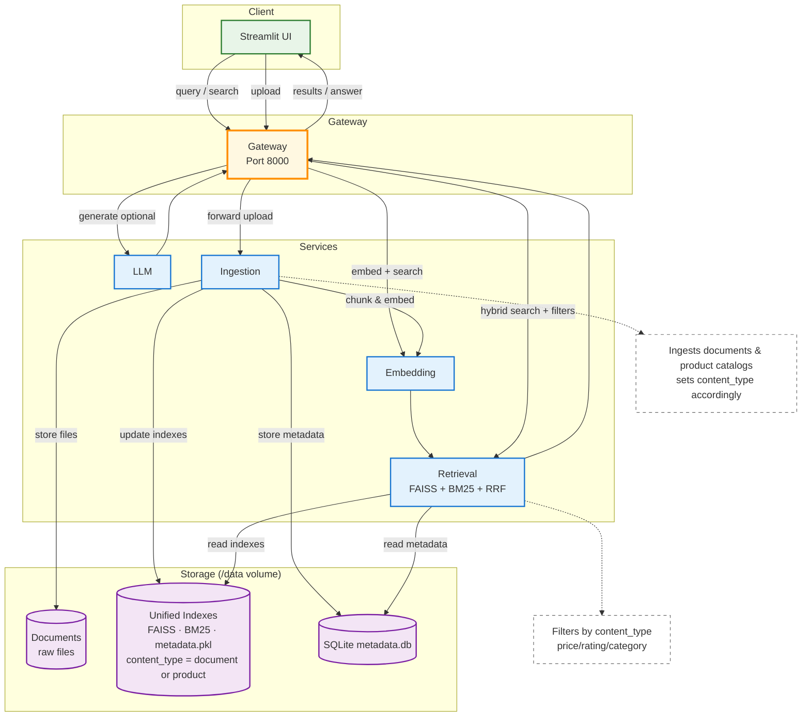
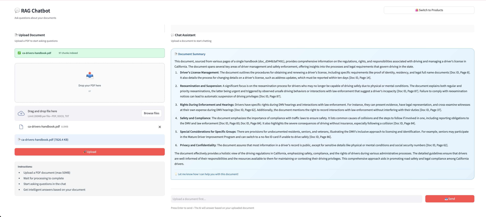
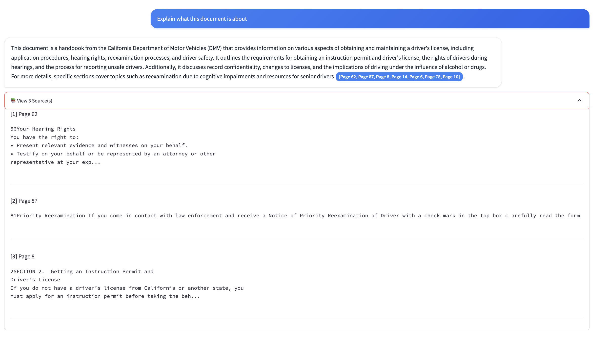
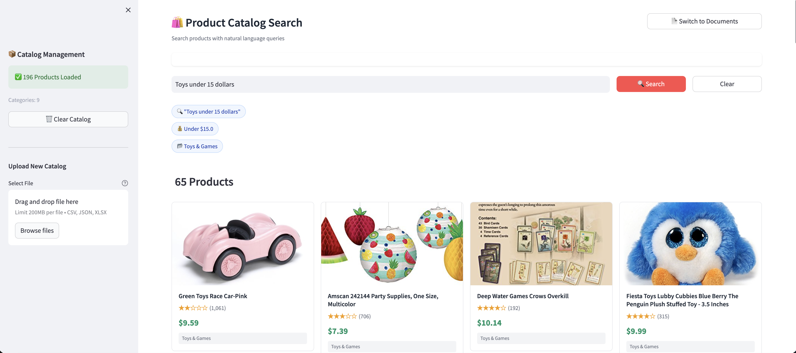

# Hybrid Search RAG System

A microservices-based RAG (Retrieval-Augmented Generation) system supporting both document Q&A and semantic product catalog search with hybrid retrieval (dense + sparse) with reranking.

## Table of Contents

- [Project Overview](#project-overview)
- [Features](#features)
- [Architecture](#architecture)
- [Prerequisites](#prerequisites)
- [Deployment & Configuration](#deployment--configuration)
- [Reranker Post-Deployment Configuration](#reranker-post-deployment-configuration)
- [User Interface](#user-interface)
- [Troubleshooting](#troubleshooting)
- [Additional Information](#additional-information)

## Project Overview

Hybrid Search RAG System is a microservices-based application that enables intelligent search and question-answering over both unstructured documents and structured product catalogs. The system combines dense vector search (FAISS) with sparse keyword search (BM25) using Reciprocal Rank Fusion (RRF) to deliver high-accuracy results. It seamlessly switches between document analysis and product discovery modes, leveraging powerful enterprise language models for generation.

## Features

- **Document RAG**: Upload PDFs, DOCX, XLSX, PPT and ask questions with citations
- **Product Catalog Search**: Upload product catalogs (CSV/JSON) and search with natural language
- **Hybrid Retrieval**: Combines FAISS (dense) and BM25 (sparse) search with RRF fusion
- **Dual Mode**: Switch between document and product modes seamlessly
- **Modern React web interface**: Streamlit-based interface with product grid and chat interface
- **RESTful API**: For integration with JSON-based communication

## Architecture

This application uses a microservices architecture where each service handles a specific part of the search and generation process. The Streamlit frontend communicates with a backend gateway that orchestrates requests across specialized services: embedding generation, retrieval, LLM processing, and data ingestion.



```
UI (8501) → Gateway (8000) → [Embedding (8001), Retrieval (8002), LLM (8003), Ingestion (8004)]
```

**Service Components:**

- **UI (Port 8501)** - Streamlit web interface for file uploads, chat, and product browsing
- **Gateway (Port 8000)** - API orchestration and routing
- **Embedding Service (Port 8001)** - Vector generation using enterprise embedding models
- **Retrieval Service (Port 8002)** - Hybrid search implementation (FAISS + BM25 + RRF)
- **LLM Service (Port 8003)** - Question answering using enterprise LLMs
- **Ingestion Service (Port 8004)** - Document/product processing and indexing

## Prerequisites

### System Requirements
Before you begin, ensure you have the following installed:

- Docker and Docker Compose
- Python 3.10+ (optional, for local development)

### Required Models
The following models must be deployed on Enterprise Inference before running this application:

| Model | Purpose |
|-------|---------|
| `BAAI/bge-base-en-v1.5` | Embedding generation for dense retrieval |
| `BAAI/bge-reranker-base` | Reranking retrieved results for improved relevance |
| `Qwen/Qwen3-4B-Instruct-2507` | LLM for question answering and generation |

Verify your models are available:
```bash
curl https://your-gateway-url/v1/models -H "Authorization: Bearer your-token"
```

### Verify Docker Installation
```bash
# Check Docker version
docker --version

# Check Docker Compose version
docker compose version

# Verify Docker is running
docker ps
```

### Credentials & Authentication
The system uses GenAI Gateway for authentication with API key-based access.

## Deployment & Configuration

### Clone the Repository
```bash
git clone https://github.com/opea-project/Enterprise-Inference.git
cd Enterprise-Inference/sample_solutions/HybridSearch
```

### Set up the Environment
Create a `.env` file from the example and configure your credentials.

```bash
cp .env.example .env
```

**Note:** The `LOCAL_URL_ENDPOINT` variable enables Docker's `extra_hosts` configuration for local domain resolution. Set it to `not-needed` if you don't require custom domain mapping.

### Configure Authentication
Configure GenAI Gateway authentication in your `.env` file:

```bash
# GenAI Gateway Configuration
GENAI_GATEWAY_URL=https://api.example.com
GENAI_API_KEY=your-api-key-here

# SSL Verification (set to false only for dev with self-signed certs)
VERIFY_SSL=true
```

**Generating API tokens by gateway type:**

- **GenAI Gateway**: Provide your GenAI Gateway URL and API key
  - To generate the GenAI Gateway API key, use the [generate-vault-secrets.sh](https://github.com/opea-project/Enterprise-Inference/blob/main/core/scripts/generate-vault-secrets.sh) script
  - The API key is the `litellm_master_key` value from the generated `vault.yml` file

- **Keycloak / APISIX Gateway**: Provide your APISIX Gateway URL and authentication token
  - To generate the APISIX authentication token, use the [generate-token.sh](https://github.com/opea-project/Enterprise-Inference/blob/main/core/scripts/generate-token.sh) script
  - The token is generated using Keycloak client credentials (expires in 15 minutes by default; a Keycloak admin can configure longer-lived tokens in the Keycloak console)
  - For Keycloak, each model has its own APISIX route path. Run `kubectl get apisixroutes` to find the route names for your deployed models (e.g., `bge-base-en-v1.5`, `bge-reranker-base`, `Qwen3-4B-Instruct-2507`)

### Configure Models
Model endpoint names differ by deployment type. Use the table below to determine the correct values:

| Variable | Xeon + Keycloak/APISIX | Xeon + GenAI Gateway | Gaudi (TEI) |
|---|---|---|---|
| `EMBEDDING_MODEL_ENDPOINT` | `bge-base-en-v1.5-vllmcpu` | `BAAI/bge-base-en-v1.5` | `BAAI/bge-base-en-v1.5` |
| `EMBEDDING_MODEL_NAME` | `BAAI/bge-base-en-v1.5` | `BAAI/bge-base-en-v1.5` | `BAAI/bge-base-en-v1.5` |
| `RERANKER_MODEL_ENDPOINT` | `bge-reranker-base-vllmcpu` | `BAAI/bge-reranker-base` | `BAAI/bge-reranker-base` |
| `RERANKER_MODEL_NAME` | `BAAI/bge-reranker-base` | `BAAI/bge-reranker-base` | `BAAI/bge-reranker-base` |
| `LLM_MODEL_ENDPOINT` | `Qwen3-4B-Instruct-2507-vllmcpu` | `Qwen/Qwen3-4B-Instruct-2507` | `Qwen/Qwen3-4B-Instruct-2507` |
| `LLM_MODEL_NAME` | `Qwen/Qwen3-4B-Instruct-2507` | `Qwen/Qwen3-4B-Instruct-2507` | `Qwen/Qwen3-4B-Instruct-2507` |

> `MODEL_ENDPOINT` is the route/model identifier sent to your gateway. For Keycloak/APISIX it is the APISIX route name (run `kubectl get apisixroutes` to verify the exact names for your deployment). `MODEL_NAME` is always the HuggingFace model ID used in the API request payload.

**Gaudi hardware (TEI backend):** Set `INFERENCE_BACKEND=tei` in your `.env`. TEI serves endpoints without the `/v1` prefix (`/embeddings`, `/rerank`) unlike vLLM which uses `/v1`. Xeon deployments use the default `INFERENCE_BACKEND=vllm`.

```bash
# Gaudi hardware only
INFERENCE_BACKEND=tei
```

**Keycloak / APISIX deployments:** Uncomment and set the per-model API endpoint variables in your `.env`. Each model needs its own APISIX route URL. Xeon route names use the `-vllmcpu` suffix by default:

```bash
# APISIX Gateway Per-Model Endpoints (required for Keycloak)
EMBEDDING_API_ENDPOINT=https://api.example.com/bge-base-en-v1.5-vllmcpu
RERANKER_API_ENDPOINT=https://api.example.com/bge-reranker-base-vllmcpu
LLM_API_ENDPOINT=https://api.example.com/Qwen3-4B-Instruct-2507-vllmcpu
```

### Running the Application
Start all services together with Docker Compose:

```bash
# Start services in detached mode
docker compose up -d --build
```

This will:
- Build all microservices
- Create containers and internal networking
- Start services in detached mode

### Check all containers are running:

```bash
docker compose ps
```

Expected output shows services with status "Up".

### View logs:

```bash
# All services
docker compose logs -f

# Individual services
docker compose logs -f gateway
docker compose logs -f embedding
docker compose logs -f retrieval
docker compose logs -f llm
docker compose logs -f ingestion
docker compose logs -f ui
```

### Verify the services are running:

```bash
# Check API health
curl http://localhost:8000/api/v1/health/services
```

## Reranker Post-Deployment Configuration

> [!IMPORTANT]
> **GenAI Gateway + Xeon deployments only.** If you deployed Enterprise Inference with GenAI Gateway on Xeon hardware and have enabled reranking (`USE_RERANKING=true`), the `BAAI/bge-reranker-base` model requires a one-time post-deployment configuration step before it will work correctly.
>
> The deployment script registers the model with the wrong provider (`openai`) and without the required `mode: rerank` field. Without this fix, all rerank requests will return a `400 BadRequestError` from LiteLLM and reranking will silently fall back or fail.

> [!NOTE]
> The following deployments do **not** require this step — the reranker works out of the box:
> - **Keycloak / APISIX** (Xeon or Gaudi): Set `RERANKER_API_ENDPOINT` in your `.env` to your APISIX route URL and ensure `USE_RERANKING=true`
> - **GenAI Gateway + Gaudi**: The reranker is pre-validated and works without LiteLLM reconfiguration

The fix involves a single `curl` command to update the model registration in LiteLLM, changing the provider to `cohere` and setting `mode: rerank`. The full step-by-step workflow — including how to find the model UUID, the exact update payload, and how to verify the changes in the LiteLLM UI — is documented in:

**[reranker-configuration.md](./reranker-configuration.md)**

**Summary of what the configuration fixes:**

| Field | Default (broken) | Required (correct) |
|---|---|---|
| LiteLLM provider | `openai` | `cohere` |
| Model mode | *(missing)* | `rerank` |
| Pass-through | `false` | `true` |
| API base | *(may include `/v1` suffix)* | `...vllm-service.default` (no `/v1`) |

---

## User Interface

### Using the Application

Access the application at: http://localhost:8501

### Test the Application

#### Document Mode



1. Switch to "Documents" mode in the sidebar.
2. Upload PDF/DOCX/XLSX/PPT files.
3. Ask questions about the uploaded documents in the chat interface.
4. View answers with citations.

**Document Q&A with Citations:**



The system provides answers with source references, showing which document chunks were used to generate the response.

#### Product Catalog Mode



1. Switch to "Products" mode in the sidebar.
2. Upload a CSV/JSON product catalog.
3. Browse products in the grid view.
4. Search with natural language (e.g., "toys under $20" or "electronics with 4+ stars").

### Key Features

The application provides a clean interface to toggle between modes:

- **Document Mode**: Chat-based Q&A with document uploads and citation tracking
- **Product Mode**: Visual product grid with semantic search and filters
- **Seamless Switching**: Toggle between modes without losing context
- **Real-time Processing**: See indexing progress and status updates

## Cleanup

Stop all services:

```bash
docker compose down
```

Remove all containers and volumes:

```bash
docker compose down -v
```

## Troubleshooting

**Services won't start:**
```bash
docker-compose logs -f [service-name]
docker-compose restart [service-name]
```

**Connection errors:**
- Verify all services are running: `docker-compose ps`
- Check service health: `curl http://localhost:8000/api/v1/health/services`

**Authentication errors:**
- Verify `GENAI_GATEWAY_URL` and `GENAI_API_KEY` in `.env`
- Ensure GenAI Gateway URL is correct and accessible

**SSL certificate errors:**
- In production, keep `VERIFY_SSL=true` (default)
- For development environments with self-signed certificates, set `VERIFY_SSL=false` in `.env`

**Index not loading:**
- Ensure `data/indexes/` directory exists and has write permissions
- Restart retrieval service after re-indexing

## Additional Information

The table provides a throughput comparison of LLM performance on **Intel Xeon** and **Intel Gaudi** machines, showing tokens processed, processing time, and effective tokens per second.

| Model Name                         | Deployment Platform| Tokens Processed | Processing Time (sec)| Tokens/sec | Completion Status                |
|------------------------------------|--------------------|------------------|----------------------|------------|----------------------------------|
| Qwen/Qwen3-8B                      | Xeon               | 126              | 28.2                 | 4.5        | Truncated at 50 tokens           |
| Qwen/Qwen3-8B                      | Gaudi              | 126              | 4.3                  | 29.3       | Truncated at 50 tokens           |
| ibm-granite/granite-3.3-8b-instruct| Xeon               | 130              | 31                   | 4.2        | Truncated at 50 tokens           |
| ibm-granite/granite-3.3-8b-instruct| Gaudi              | 130              | 4.5                  | 28.8       | Truncated at 50 tokens           |

*All completions were cut off at 50 tokens due to the max_tokens setting. Tokens/sec is calculated as Tokens Processed divided by Processing Time (sec).*
