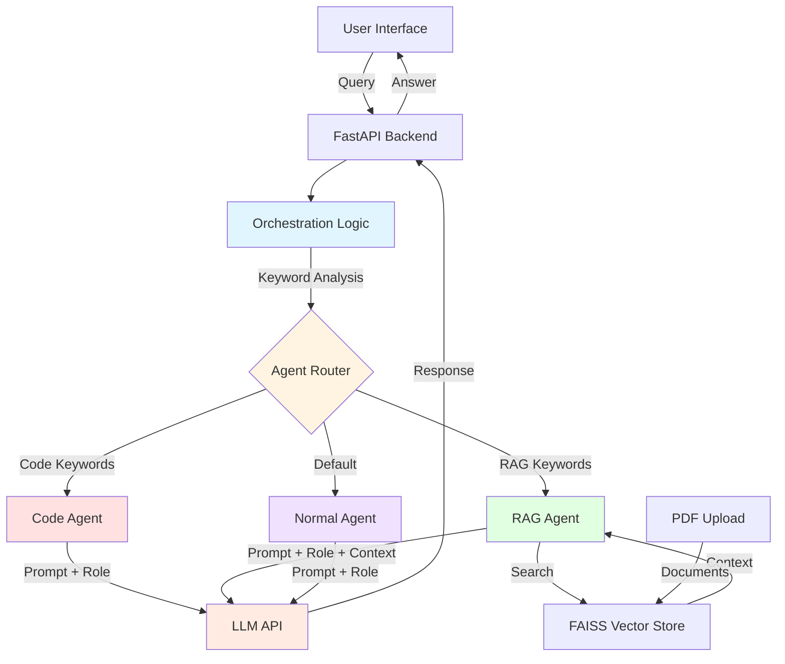

## Multi-Agent Q&A Application

A sophisticated multi-agent Q&A application featuring intelligent task delegation to specialized agents with enterprise inference integration.

## Table of Contents

- [Project Overview](#project-overview)
- [Features](#features)
- [Architecture](#architecture)
- [Prerequisites](#prerequisites)
- [Quick Start Deployment](#quick-start-deployment)
- [User Interface](#user-interface)
- [Troubleshooting](#troubleshooting)
- [Additional Info](#additional-info)

---
## Project Overview

The multiagent-qna project is a sophisticated Question & Answer application built on a multi-agent architecture. Its core function is to receive a user's query, intelligently determine the nature of the question, and delegate it to the most suitable specialized agent for generating a high-quality response. The system is designed for enterprise environments, integrating with enterprise-grade inference APIs for its language model interactions.

---

## Features

- **Multi-Agent Architecture**: Orchestration agent that intelligently routes queries to specialized agents
- **Specialized Agents**:
  - **Code Agent**: Handles code-related questions and programming queries
  - **RAG Agent**: Retrieves and answers questions from documents
  - **Normal Agent**: Handles general questions and conversations
- **Modern UI**: ChatGPT-like interface with settings management
- **Enterprise Integration**: Uses enterprise-inference API for LLM interactions
- **Configurable**: Easily configure agent roles, goals, and behavior via UI

---

## Architecture

Below is the multi-agent system architecture showing how user queries are intelligently routed to specialized agents. The orchestration layer analyzes incoming queries using keyword detection and delegates them to the appropriate agent (Code, RAG, or Normal) for processing, ensuring each query is handled by the most qualified specialist.



The application consists of:
1. **Orchestration Agent**: Analyzes user queries and delegates to appropriate specialized agents
2. **Specialized Agents**: Each handles a specific domain (code, RAG, general)
3. **API Layer**: FastAPI backend with enterprise-inference integration
4. **UI**: React-based chat interface with settings management

**Service Components:**

1. **React Web UI (Port 3000)** -  Provides ChatGPT-like interface with settings management for configuring agent roles, goals, and behavior

2. **FastAPI Backend (Port 5001)** - Orchestrates multi-agent system, analyzes queries using keyword detection, delegates to specialized agents (Code, RAG, Normal), and manages FAISS vector store for document retrieval

**Typical Flow:**

1. User submits a query through the chat interface.
2. The FastAPI backend receives the query and passes it to the orchestration logic.
3. The orchestration logic analyzes the query using keyword detection to determine intent.
4. The agent router delegates the query to the appropriate specialized agent:
   - **Code-related queries** (keywords: code, function, debug, etc.) → Code Agent
   - **Document-based queries** (keywords: document, PDF, search, etc.) → RAG Agent
   - **General queries** → Normal Agent
5. If RAG Agent is selected:
   - Searches the FAISS vector store for relevant document context
   - Retrieves matching chunks to augment the prompt
6. The selected agent constructs a specialized prompt with its role, goal, and context.
7. The agent calls the enterprise LLM API with the pre-configured token and specialized prompt.
8. The LLM generates a response tailored to the agent's expertise.
9. The response is returned to the user via the UI with agent attribution showing which specialist handled the query.

---

## Prerequisites

### System Requirements

Before you begin, ensure you have the following installed:

- **Docker and Docker Compose**
- **Enterprise inference endpoint access** (token-based authentication)

### Required API Configuration

**For Inference Service:**

This application supports multiple inference deployment patterns:

**GenAI Gateway**: Provide your GenAI Gateway URL and API key
  - URL format: https://api.example.com
  - To generate the GenAI Gateway API key, use the [generate-vault-secrets.sh](https://github.com/opea-project/Enterprise-Inference/blob/main/core/scripts/generate-vault-secrets.sh) script
  - The API key is the litellm_master_key value from the generated vault.yml file

**APISIX Gateway**: Provide your APISIX Gateway URL and authentication token
  - URL format: https://api.example.com/bge-base-en-v1.5 (for embedding) and https://api.example.com/Llama-3.1-8B-Instruct (for inference)
  - Note: APISIX requires the model name in the URL path
  - To generate the APISIX authentication token, use the [generate-token.sh](https://github.com/opea-project/Enterprise-Inference/blob/main/core/scripts/generate-token.sh) script
  - The token is generated using Keycloak client credentials

Configuration requirements:
- INFERENCE_API_ENDPOINT: URL to your inference service (example: https://api.example.com)
- INFERENCE_API_TOKEN: Authentication token/API key for your chosen service
- EMBEDDING_MODEL_NAME: Embedding model name (default: BAAI/bge-base-en-v1.5)
- INFERENCE_MODEL_NAME: Inference model name (default: meta-llama/Llama-3.1-8B-Instruct)
- EMBEDDING_API_ENDPOINT: (Optional, for APISIX only) URL with embedding model in path
- INFERENCE_MODEL_ENDPOINT: (Optional, for APISIX only) URL with inference model in path

### Local Development Configuration

**For Local Testing Only**

If you're testing with a local inference endpoint using a custom domain (e.g., `api.example.com` mapped to localhost in your hosts file):

1. Edit `api/.env` and set:
   ```bash
   LOCAL_URL_ENDPOINT=inference.example.com
   ```
   (Use the domain name from your INFERENCE_API_ENDPOINT without `https://`)

2. This allows Docker containers to resolve your local domain correctly.

**Note:** For public domains or cloud-hosted endpoints, leave the default value `not-needed`.

### Verify Docker Installation

```bash
# Check Docker version
docker --version

# Check Docker Compose version
docker compose version

# Verify Docker is running
docker ps
```
---

## Quick Start Deployment

### Clone the Repository

```bash
git clone https://github.com/opea-project/Enterprise-Inference.git
cd Enterprise-Inference/sample_solutions/MultiAgentQnA
```

### Set up the Environment

This application requires **two `.env` files** for proper configuration:

1. **Root `.env` file** (for Docker Compose variables)
2. **`api/.env` file** (for backend application configuration)

#### Step 1: Create Root `.env` File

```bash
# From the MultiAgentQnA directory
cat > .env << EOF
# Docker Compose Configuration
LOCAL_URL_ENDPOINT=not-needed
EOF
```

**Note:** If using a local domain (e.g., `api.example.com` mapped to localhost), replace `not-needed` with your domain name (without `https://`).

#### Step 2: Create `api/.env` File

This application requires an `api/.env` file for proper configuration. Create it with the commands below:

```bash
# Create the api/.env file
cat > api/.env << EOF
# Inference API Configuration
# INFERENCE_API_ENDPOINT: URL to your inference service (without /v1 suffix)
#
# **GenAI Gateway**: Provide your GenAI Gateway URL and API key
#   - URL format: https://genai-gateway.example.com
#   - To generate the GenAI Gateway API key, use the [generate-vault-secrets.sh] script
#   - The API key is the litellm_master_key value from the generated vault.yml file
#
# **APISIX Gateway**: Provide your APISIX Gateway URL and authentication token
#   - For APISIX, include the model name in the INFERENCE_API_ENDPOINT path
#   - Example: https://apisix-gateway.example.com/Llama-3.1-8B-Instruct
#   - Set EMBEDDING_API_ENDPOINT separately for the embedding model
#   - Example: https://apisix-gateway.example.com/bge-base-en-v1.5
#   - To generate the APISIX authentication token, use the [generate-token.sh] script
#   - The token is generated using Keycloak client credentials
#
# INFERENCE_API_TOKEN: Authentication token/API key for the inference service
INFERENCE_API_ENDPOINT=https://your-api.example.com/
INFERENCE_API_TOKEN=your-pre-generated-token-here

# Model Configuration
EMBEDDING_MODEL_NAME=BAAI/bge-base-en-v1.5
INFERENCE_MODEL_NAME=meta-llama/Llama-3.1-8B-Instruct

# APISIX Gateway Endpoints
# Uncomment and set these when using APISIX Gateway:
# IMPORTANT: Use exact APISIX route paths:
# Example routes: /bge-base-en-v1.5/* and /Llama-3.1-8B-Instruct/*
# INFERENCE_API_ENDPOINT=https://api.example.com/Llama-3.1-8B-Instruct
# EMBEDDING_API_ENDPOINT=https://api.example.com/bge-base-en-v1.5

# Local URL Endpoint (only needed for non-public domains)
# If using a local domain like api.example.com mapped to localhost:
#   Set this to: api.example.com (domain without https://)
# If using a public domain, set any placeholder value like: not-needed
LOCAL_URL_ENDPOINT=not-needed
EOF
```

Or manually create `api/.env` with:

```bash
# Inference API Configuration
# INFERENCE_API_ENDPOINT: URL to your inference service (without /v1 suffix)
#
# **GenAI Gateway**: Provide your GenAI Gateway URL and API key
#   - URL format: https://genai-gateway.example.com
#   - To generate the GenAI Gateway API key, use the [generate-vault-secrets.sh] script
#   - The API key is the litellm_master_key value from the generated vault.yml file
#
# **APISIX Gateway**: Provide your APISIX Gateway URL and authentication token
#   - For APISIX, include the model name in the INFERENCE_API_ENDPOINT path
#   - Example: https://apisix-gateway.example.com/Llama-3.1-8B-Instruct
#   - Set EMBEDDING_API_ENDPOINT separately for the embedding model
#   - Example: https://apisix-gateway.example.com/bge-base-en-v1.5
#   - To generate the APISIX authentication token, use the [generate-token.sh] script
#   - The token is generated using Keycloak client credentials
#
# INFERENCE_API_TOKEN: Authentication token/API key for the inference service
INFERENCE_API_ENDPOINT=https://your-api.example.com/
INFERENCE_API_TOKEN=your-pre-generated-token-here

# Model Configuration
EMBEDDING_MODEL_NAME=BAAI/bge-base-en-v1.5
INFERENCE_MODEL_NAME=meta-llama/Llama-3.1-8B-Instruct

# APISIX Gateway Endpoints
# Uncomment and set these when using APISIX Gateway:
# IMPORTANT: Use exact APISIX route paths:
# Example routes: /bge-base-en-v1.5/* and /Llama-3.1-8B-Instruct/*
# INFERENCE_API_ENDPOINT=https://your-api-endpoint.com/Llama-3.1-8B-Instruct
# EMBEDDING_API_ENDPOINT=https://your-api-endpoint.com/bge-base-en-v1.5

# Local URL Endpoint (only needed for non-public domains)
# If using a local domain like api.example.com mapped to localhost:
#   Set this to: api.example.com (domain without https://)
# If using a public domain, set any placeholder value like: not-needed
LOCAL_URL_ENDPOINT=not-needed
```

**Important Configuration Notes:**

- **INFERENCE_API_ENDPOINT**: Your actual inference service URL (replace `https://your-api-endpoint.com/deployment`)
  - For APISIX/Keycloak deployments, the model name must be included in the endpoint URL (e.g., `https://apisix-gateway.example.com/Llama-3.1-8B-Instruct`)
- **INFERENCE_API_TOKEN**: Your actual pre-generated authentication token
- **LOCAL_URL_ENDPOINT**: Only needed if using local domain mapping (see [Local Development Configuration](#local-development-configuration))

**Note**: The docker-compose.yml file automatically loads environment variables from both `.env` (root) and `./api/.env` (backend) files.

### Running the Application

Start both API and UI services together with Docker Compose:

```bash
# From the MultiAgentQnA directory
docker compose up --build

# Or run in detached mode (background)
docker compose up -d --build
```

The API will be available at: `http://localhost:5001`  
The UI will be available at: `http://localhost:3000`

**View logs**:

```bash
# All services
docker compose logs -f

# Backend only
docker compose logs -f multiagent-qna-backend

# Frontend only
docker compose logs -f multiagent-qna-frontend
```

**Verify the services are running**:

```bash
# Check API health
curl http://localhost:5001/health

# Check if containers are running
docker compose ps
```
---

## User Interface

**Using the Application**

Make sure you are at the `http://localhost:3000` URL

You will be directed to the main page which has each feature


### Chat Interface

1. Navigate to the chat interface
2. Type your question in the input box
3. The orchestration agent will analyze your query and route it to the appropriate specialized agent
4. View the response with agent attribution

### Settings Page

Configure agents:
- **Orchestration Agent**: Role, goal, and backstory
- **Code Agent**: Code-specific configuration
- **RAG Agent**: Document retrieval settings
- **Normal Agent**: General conversation settings

**UI Configuration**

When running with Docker Compose, the UI automatically connects to the backend API. The frontend is available at `http://localhost:3000` and the API at `http://localhost:5001`.

For production deployments, you may want to configure a reverse proxy or update the API URL in the frontend configuration.

### Stopping the Application


```bash
docker compose down
```

---

## Troubleshooting

For comprehensive troubleshooting guidance, common issues, and solutions, refer to:

[TROUBLESHOOTING.md](TROUBLESHOOTING.md)

---

## Additional Info

The following models have been validated with MultiAgentQnA:

| Model | Hardware |
|-------|----------|
| **meta-llama/Llama-3.1-8B-Instruct** | Gaudi |
| **Qwen/Qwen3-4B-Instruct-2507** | Xeon |
| **BAAI/bge-base-en-v1.5** (embeddings) | Gaudi |
