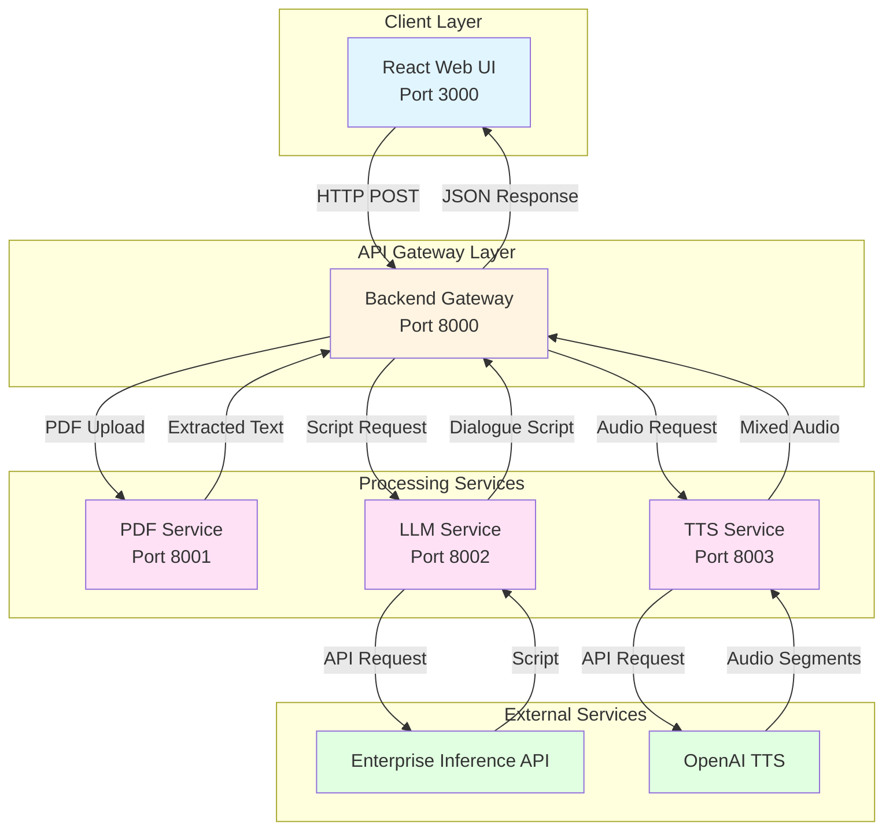
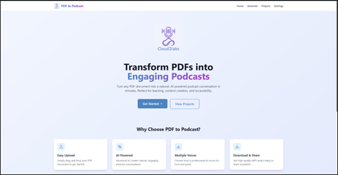
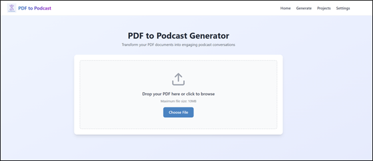
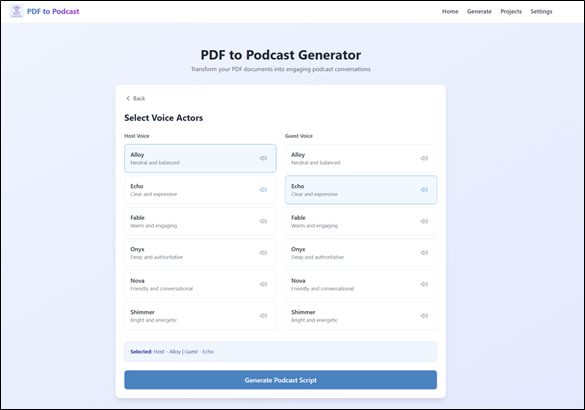
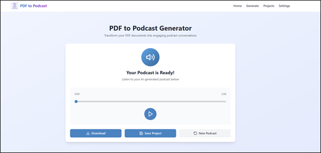

## PDF to Podcast Generator

AI-powered application that transforms PDF documents into engaging podcast-style audio conversations using enterprise inference endpoints for script generation and OpenAI TTS for audio synthesis.

## Table of Contents

- [Project Overview](#project-overview)
- [Features](#features)
- [Architecture](#architecture)
- [Prerequisites](#prerequisites)
- [Quick Start Deployment](#quick-start-deployment)
- [User Interface](#user-interface)
- [Troubleshooting](#troubleshooting)
- [Additional Info](#additional-info)

---

## Project Overview

PDF to Podcast Generator is a microservices-based application that converts PDF documents into natural podcast-style audio conversations. The system extracts text from PDFs, generates engaging dialogue using Large Language Models, and synthesizes high-quality audio using Text-to-Speech technology.

---

## Features

- Digital PDF text extraction with support for text-based PDFs up to 10 MB
- AI-powered script generation with natural host and guest conversation format
- Enterprise inference endpoints for LLM-based script generation
- High-quality audio generation using OpenAI TTS with 6 different voice options
- Modern React web interface with real-time progress tracking
- Integrated audio player with waveform visualization
- Project management and organization with download functionality
- RESTful API for integration with JSON-based communication

---

## Architecture

This application uses a microservices architecture where each service handles a specific part of the podcast generation process. The React frontend communicates with a backend gateway that orchestrates requests across three specialized services: PDF processing, script generation, and audio synthesis. The LLM service uses enterprise inference endpoints with token-based authentication for script generation, while the TTS service uses OpenAI TTS API for audio generation. This separation allows for flexible deployment options and easy scaling of individual components.



This application is built using FastAPI microservices architecture with Docker containerization.

**Service Components:**

1. **React Web UI (Port 3000)** - Handles file uploads, displays generation progress, and provides audio playback interface

2. **Backend Gateway (Port 8000)** - Routes requests to microservices and manages job lifecycle and state

3. **PDF Service (Port 8001)** - Extracts text from PDF files using PyPDF2 and pdfplumber libraries (no external API dependencies)

4. **LLM Service (Port 8002)** - Generates podcast dialogue scripts using enterprise inference endpoints with token-based authentication

5. **TTS Service (Port 8003)** - Synthesizes audio using OpenAI TTS API with multiple voice support and audio mixing

---

## Prerequisites

### System Requirements

Before you begin, ensure you have the following installed:

- **Docker and Docker Compose**
- **Enterprise inference endpoint access** (token-based authentication)

#### Deploy Required Models

See the table below for supported models, hardware, and gateway configuration.

| Model | Xeon w/APISIX/Keycloak | Xeon w/GenAI Gateway | Gaudi w/APISIX/Keycloak | Gaudi w/GenAI Gateway |
|---|:---:|:---:|:---:|:---:|
| **deepseek-ai/DeepSeek-R1-Distill-Qwen-32B** | ❌ | ❌ | ✅ Validated on Dell XE7740 | ✅ Validated on Dell XE7740 |
| **Qwen/Qwen3-4B-Instruct-2507** | ✅ Validated on Dell XE7740 | ✅ Validated on Dell XE7740 | ❌ | ❌ |

### Verify Docker Installation

```bash
# Check Docker version
docker --version

# Check Docker Compose version
docker compose version

# Verify Docker is running
docker ps
```

### Required API Configuration

**For LLM Service (Script Generation):**

This application supports multiple inference deployment patterns:

**GenAI Gateway**: Provide your GenAI Gateway URL and API key
  - URL format: https://api.example.com
  - To generate the GenAI Gateway API key, use the [generate-vault-secrets.sh](https://github.com/opea-project/Enterprise-Inference/blob/main/core/scripts/generate-vault-secrets.sh) script
  - The API key is the litellm_master_key value from the generated vault.yml file

**APISIX Gateway**: Provide your APISIX Gateway URL and authentication token
  - URL format: https://api.example.com/DeepSeek-R1-Distill-Qwen-32B
  - Note: APISIX requires the model name in the URL path. Run `kubectl get apisixroutes` for all models.
  - To generate the APISIX authentication token, use the [generate-token.sh](https://github.com/opea-project/Enterprise-Inference/blob/main/core/scripts/generate-token.sh) script
  - The token is generated using Keycloak client credentials

**For TTS Service (Audio Generation):**

OpenAI API Key for text-to-speech:
- Sign up at https://platform.openai.com/
- Create API key at https://platform.openai.com/api-keys
- Key format starts with `sk-proj-`
- Requires access to TTS APIs (tts-1-hd model)

---

## Quick Start Deployment

### Clone the Repository

```bash
git clone https://github.com/opea-project/Enterprise-Inference.git
cd Enterprise-Inference/sample_solutions/PDFToPodcast
```

### Set up the Environment

This application requires an `.env` file in the root directory for proper configuration. Create it using [.env.example](./.env.example) with the commands below:

```bash
cp .env.example .env
```
Then modify it as needed, with special consideration to certain environment variables mentioned below. Read through the .env file for full instructions.

1. **Backend Service Configuration**
    - No changes needed. Use default values.

2. **PDF Service Configuration**
    - No changes needed. Use default values.

3. **LLM Service Configuration**
    - **INFERENCE_API_ENDPOINT**: Your actual inference service URL (replace `https://api.example.com`)
        - For APISIX/Keycloak deployments, the model name must be included in the endpoint URL (e.g., `https://api.example.com/DeepSeek-R1-Distill-Qwen-32B`)
    - **INFERENCE_API_TOKEN**: Your actual pre-generated authentication token
    - **INFERENCE_MODEL_NAME**: Use the exact model name from your inference service
        - To check available models: `curl https://api.example.com/v1/models -H "Authorization: Bearer your-token"`
    - **LOCAL_URL_ENDPOINT**: Only needed if using local domain mapping (i.e. `api.example.com` mapped to localhost) for Docker containers to resolve correctly.
        - Use the domain name from INFERENCE_API_ENDPOINT without `https://`
        - For public domains or cloud-hosted endpoints, leave the default value `not-needed`
    - **VERIFY_SSL**: Controls SSL certificate verification (default: `true`)
        - Set to `false` only for development environments with self-signed certificates
        - Keep as `true` for production environments

4. **TTS Service Configuration**
    - **OPENAI_API_KEY**: Replace with actual OpenAI API key
    - **DEFAULT_HOST_VOICE**, **DEFAULT_GUEST_VOICE**: Voice used for the podcast
        - Default voices are alloy (host) and nova (guest)
        - Available TTS voices: alloy, echo, fable, onyx, nova, shimmer

**Note**: The docker-compose.yaml file automatically loads environment variables from `.env` for all services.

### Running the Application

Start both API and UI services together with Docker Compose:

```bash
# From the PDFToPodcast directory
docker compose up --build

# Or run in detached mode (background)
docker compose up -d --build
```
The Backend will be available at: http://localhost:8000

The UI will be available at: http://localhost:3000

The LLM-service will be available at: http://localhost:8002

The PDF-service will be available at: http://localhost:8001

The TTS-service will be available at: http://localhost:8003

**View logs**:

```bash
# All services
docker compose logs -f

# Backend only
docker compose logs -f backend

# Frontend only
docker compose logs -f frontend

# Specific service (pdf-service, llm-service, tts-service)
docker compose logs -f pdf-service
docker compose logs -f llm-service
docker compose logs -f tts-service
```

**Check container status**:

```bash
# Check status of all containers
docker compose ps

# Check detailed status with resource usage
docker stats

# Check if all containers are running and healthy
docker ps --filter "name=pdf-podcast"
```

**Verify the services are running**:

```bash
# Check API health endpoints
curl http://localhost:8002/health

# Check individual service health
curl http://localhost:8001/health  # PDF Service
curl http://localhost:8002/health  # LLM Service
curl http://localhost:8003/health  # TTS Service
curl http://localhost:8000/health  # Backend Gateway
```

## User Interface

**Using the Application**

Make sure you are at the localhost:3000 url

**Test the Application**

1. Upload a PDF file (max 10MB)
2. Wait for text extraction
3. Select host and guest voices
4. Click "Generate Script" and wait 15-30 seconds
5. Review generated script
6. Click "Generate Audio" and wait 30-60 seconds
7. Listen to your podcast










### Stopping the Application


```bash
docker compose down
```

## Troubleshooting

For detailed troubleshooting guidance and solutions to common issues, refer to:

[TROUBLESHOOTING_and_ADDITIONAL_INFO.md](./TROUBLESHOOTING_and_ADDITIONAL_INFO.md)
