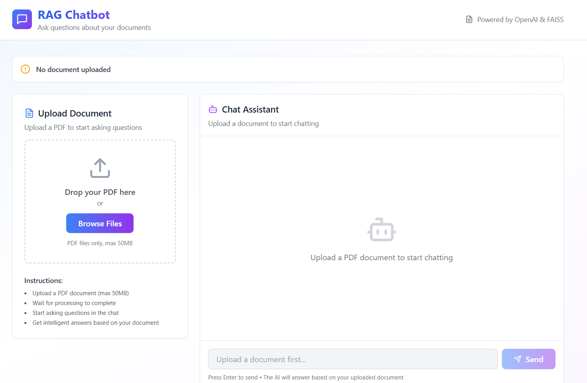

## RAG Chatbot

A full-stack Retrieval-Augmented Generation (RAG) application that enables intelligent, document-based question answering.
The system integrates a FastAPI backend powered by LangChain, FAISS, and AI models, alongside a modern React + Vite + Tailwind CSS frontend for an intuitive chat experience.

## Table of Contents

- [Project Overview](#project-overview)
- [Features](#features)
- [Architecture](#architecture)
- [Prerequisites](#prerequisites)
- [Quick Start Deployment](#quick-start-deployment)
- [User Interface](#user-interface)
- [Troubleshooting](#troubleshooting)
- [Additional Info](#additional-info)

---

## Project Overview

The **RAG Chatbot** demonstrates how retrieval-augmented generation can be used to build intelligent, document-grounded conversational systems. It retrieves relevant information from a knowledge base, passes it to a large language model, and generates a concise and reliable answer to the user’s query. This project integrates seamlessly with cloud-hosted APIs or local model endpoints, offering flexibility for research, enterprise, or educational use.

---

## Features

**Backend**

- Clean PDF upload with validation
- LangChain-powered document processing
- FAISS-CPU vector store for efficient similarity search
- Enterprise inference endpoints for embeddings and LLM
- Token-based authentication for inference API
- Comprehensive error handling and logging
- File validation and size limits
- CORS enabled for web integration
- Health check endpoints
- Modular architecture (routes + services)

**Frontend**

- PDF file upload with drag-and-drop support
- Real-time chat interface
- Modern, responsive design with Tailwind CSS
- Built with Vite for fast development
- Live status updates
- Mobile-friendly

---

## Architecture

Below is the architecture as it consists of a server that waits for documents to embed and index into a vector database. Once documents have been uploaded, the server will wait for user queries which initiates a similarity search in the vector database before calling the LLM service to summarize the findings.


**Service Components:**

1. **React Web UI (Port 3000)** - Provides intuitive chat interface with drag-and-drop PDF upload, real-time messaging, and document-grounded Q&A interaction

2. **FastAPI Backend (Port 5001)** - Handles document processing, FAISS vector storage, LangChain integration, and orchestrates retrieval-augmented generation for accurate responses

**Typical Flow:**

1. User uploads a document through the web UI.
2. The backend processes the document by splitting it and transforming it into embeddings before storing it in the vector database.
3. User sends a question through the web UI.
4. The backend retrieves relevant content from stored documents.
5. The model generates a response based on retrieved context.
6. The answer is displayed to the user via the UI.

---

## Prerequisites

### System Requirements

Before you begin, ensure you have the following installed:

- **Docker and Docker Compose**
- **Enterprise Inference endpoint access** (token-based authentication, see below for models and configs)

#### Deploy Required Models

See the table below for supported models, hardware, and gateway configuration.

| Model | Xeon w/APISIX/Keycloak | Xeon w/GenAI Gateway | Gaudi w/APISIX/Keycloak | Gaudi w/GenAI Gateway |
|---|:---:|:---:|:---:|:---:|
| **meta-llama/Llama-3.1-8B-Instruct** | ❌ | ❌ | ✅ Validated on Dell XE7740 | ✅ Validated on Dell XE7740 |
| **Qwen/Qwen3-4B-Instruct-2507** | ✅ Validated on Dell XE7740 | ✅ Validated on Dell XE7740 | ❌ | ❌ |

In addition, an embedding model must be deployed.
| Model | Xeon w/APISIX/Keycloak | Xeon w/GenAI Gateway | Gaudi w/APISIX/Keycloak | Gaudi w/GenAI Gateway |
|---|:---:|:---:|:---:|:---:|
| **BAAI/bge-base-en-v1.5** | ✅ Validated on Dell XE7740 | ❌ | ✅ Validated on Dell XE7740 | ✅ Validated on Dell XE7740 |

### Required API Configuration

**For Inference Service (RAG Chatbot):**

This application supports multiple inference deployment patterns:

**GenAI Gateway**: Provide your GenAI Gateway URL and API key
  - URL format: https://api.example.com
  - To generate the GenAI Gateway API key, use the [generate-vault-secrets.sh](https://github.com/opea-project/Enterprise-Inference/blob/main/core/scripts/generate-vault-secrets.sh) script
  - The API key is the litellm_master_key value from the generated vault.yml file

**APISIX Gateway**: Provide your APISIX Gateway URL and authentication token
  - URL format: https://api.example.com/Llama-3.1-8B-Instruct
  - Note: APISIX requires the model name in the URL path
  - To generate the APISIX authentication token, use the [generate-token.sh](https://github.com/opea-project/Enterprise-Inference/blob/main/core/scripts/generate-token.sh) script
  - The token is generated using Keycloak client credentials

### Verify Docker Installation

```bash
# Check Docker version
docker --version

# Check Docker Compose version
docker compose version

# Verify Docker is running
docker ps
```
---

## Quick Start Deployment

### Clone the Repository

```bash
git clone https://github.com/opea-project/Enterprise-Inference.git
cd Enterprise-Inference/sample_solutions/RAGChatbot
```

### Set up the Environment

This application requires an `.env` file in the root directory for proper configuration. Create it using [.env.example](./.env.example) with the commands below:

```bash
cp .env.example .env
```
Then modify it as needed, with special consideration to certain environment variables mentioned below. Read through the .env file for full instructions.

**Important Configuration Notes:**

- **INFERENCE_API_ENDPOINT**: Your actual inference service URL (replace `https://api.example.com`)
  - For APISIX/Keycloak deployments, the model name must be included in the endpoint URL (e.g., `https://api.example.com/Llama-3.1-8B-Instruct`)
- **INFERENCE_API_TOKEN**: Your actual pre-generated authentication token
- **EMBEDDING_MODEL_NAME**, **INFERENCE_MODEL_NAME**: Use the exact model name from your inference service
  - To check available models: `curl https://api.example.com/v1/models -H "Authorization: Bearer your-token"`
- **EMBEDDING_API_ENDPOINT** (APISIX only): Your actual embedding service URL
- **LOCAL_URL_ENDPOINT**: Only needed if using local domain mapping (i.e. `api.example.com` mapped to localhost) for Docker containers to resolve correctly.
  - Use the domain name from INFERENCE_API_ENDPOINT without `https://`
  - For public domains or cloud-hosted endpoints, leave the default value `not-needed`
- **VERIFY_SSL**: Controls SSL certificate verification (default: `true`)
  - Set to `false` only for development environments with self-signed certificates
  - Keep as `true` for production environments

**Note**: The docker-compose.yaml file automatically loads environment variables from `.env` for the backend service.

### Running the Application

Start both API and UI services together with Docker Compose:

```bash
# From the RAGChatbot directory
docker compose up --build

# Or run in detached mode (background)
docker compose up -d --build
```

The API will be available at: `http://localhost:5001`  
The UI will be available at: `http://localhost:3000`

**View logs**:

```bash
# All services
docker compose logs -f

# Backend only
docker compose logs -f backend

# Frontend only
docker compose logs -f frontend
```

**Verify the services are running**:

```bash
# Check API health
curl http://localhost:5001/health

# Check if containers are running
docker compose ps
```

## User Interface

**Using the Application**

Make sure you are at the `http://localhost:3000` URL

You will be directed to the main page which has each feature



Upload a PDF:

- Drag and drop a PDF file, or
- Click "Browse Files" to select a file
- Wait for processing to complete

Start chatting:

- Type your question in the input field
- Press Enter or click Send
- Get AI-powered answers based on your document

**UI Configuration**

When running with Docker Compose, the UI automatically connects to the backend API. The frontend is available at `http://localhost:3000` and the API at `http://localhost:5001`.

For production deployments, you may want to configure a reverse proxy or update the API URL in the frontend configuration.

### Stopping the Application

```bash
docker compose down
```

## Troubleshooting

For comprehensive troubleshooting guidance, common issues, and solutions, refer to:

[Troubleshooting Guide - TROUBLESHOOTING.md](./TROUBLESHOOTING.md)
